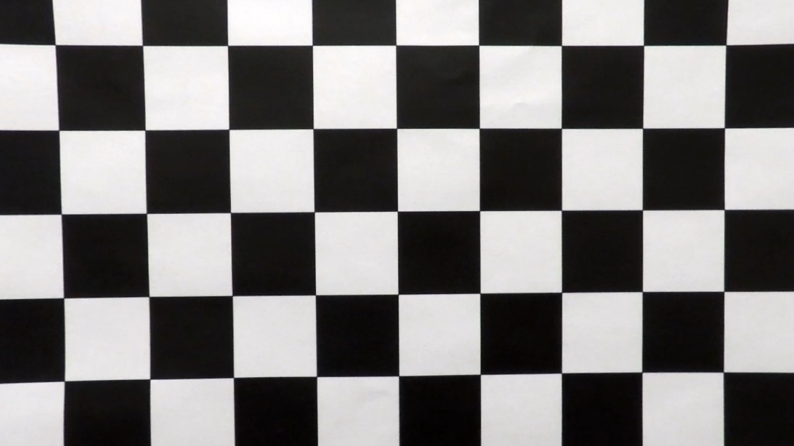
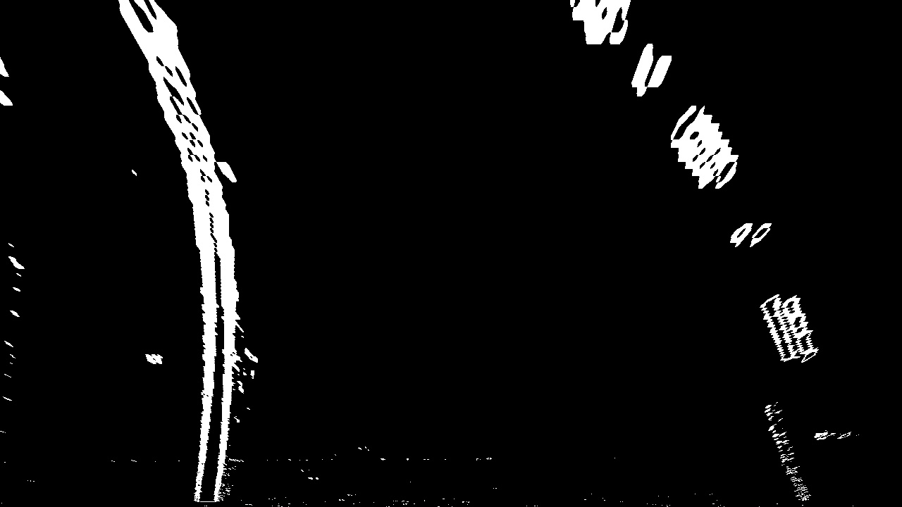
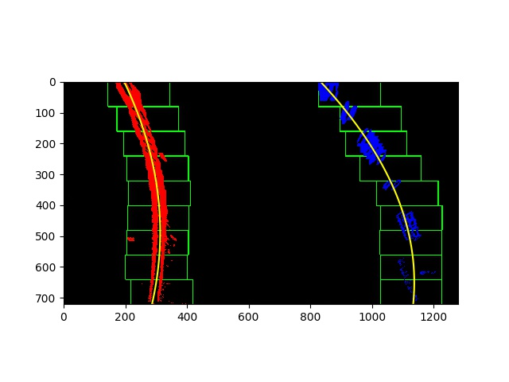
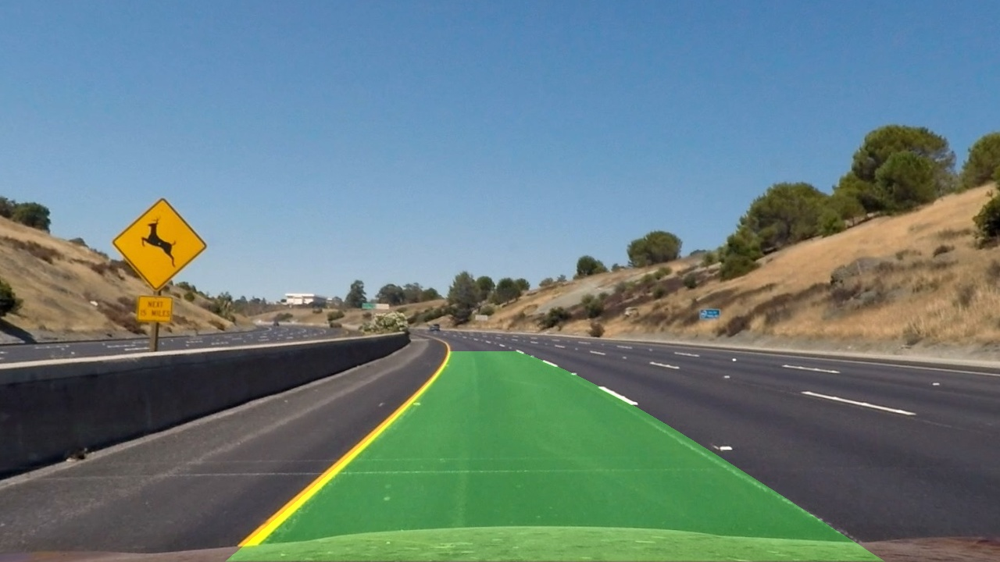

# Advanced Lane Lines
The goal of this project was to implement an algorithm that can detect lane lines with different colors (yellow and white) under different lighting conditions (i.e. shadows) and road qualities. The intention was to improve the detection qualitiy of the very first project of this course.

## 1. The Pipeline
The pipeline from an input image to the output image with the drawn lane on it is as follows:
- Camera calibration (only once)
- Undistortion
- Filtering by gradient, saturation and lightness
- Perspective transformation
- Finding lines with sliding window method
- Fitting polynomials to the lines
- Drawing the lane on the undistorted image

##### 1. Camera calibration
All lenses inflict distortions to images, thus the first step is to find the camera parameters in order to undistort the images. Therefore, several images of chessboard patterns are used, OpenCV can then create the camera matrix by providing the "real world" points for each image. OpenCV detects the corresponding image points automatically. This procedure has to be done only once, the parameters can be used for all further images. Below you can see an example of an chessboard pattern that gets undistorted.

##### 2. Filtering
In order to find the lines the images have to be filtered by several ciriteria. The first filter uses the Sobel operator in order to compute the gradients between the pixels, effectively finding edges within the image. The second and third filter are using color attributes. Therefore, the image gets converted from the usual RGB color space to the HLS color space, HLS tries to represent the colors more like the human eye recognizes them, making it a better choice than RGB for color detection matters. The saturation, as well as the lightness channels are being used to detect the colors yellow and white within the image. For a better detection of yellow lines in dark spots (i.e. shadows from trees) the S-channel gets multiplied by a certain value. The downside is that, for example, the sky now also gets detected by the filter. The good thing is that only the lower half of the image will be used for the line detection.

##### 3. Perspectice transformation
In order to calculate any curvature or polynomials, the lines need to be warped to a bird's view perspective. This way it is more easy for algorithms to detect the direction of the lines. A trapezoid quad that includes the main part of the lane is used together with OpenCV to warp this part of the image onto a rectangular shape.

##### 4. Sliding window
With the lines being transformed to the bird's eye view, the two lines can be found creating histograms within the lower half of the image. Two separate windows are being placed to the peaks of both histograms. They are moved upwards while being able to shift horizontally for a certain amount, in order to find the highest number of line pixels within them. This continues until the top of the image has been reached. Taking the center of mass of each window returns a list of points for each line, which can be used to fit a polynomial on them.

##### 5. Fitting polynomials
Numpy is used to fit polynomials onto the found line pixels. This helps to predict how the lane will continue outside of the detected scope.

##### 6. Drawing the lane
Finally, the lane can be drawn onto the undistorted input image. The output of the project_video.mp4 can be found in output.mp4.

## 2. Discussion
For the project video the algorithm works pretty well. I also tried to find the lanes for the two challenge videos, but the results were rather bad. One issue is that the asphalt is brighter, making the yellow lines hard to detect, even for the human eye. Another difficulty is the curvy road in the harder challenge video. The perspective transformation has been set up for either straight lanes or only slight curves. For sharp curves, a smaller portion of the binary image has to be warped to bird's eye view. Thus the parameters for waping would have to dynamic, not static.
